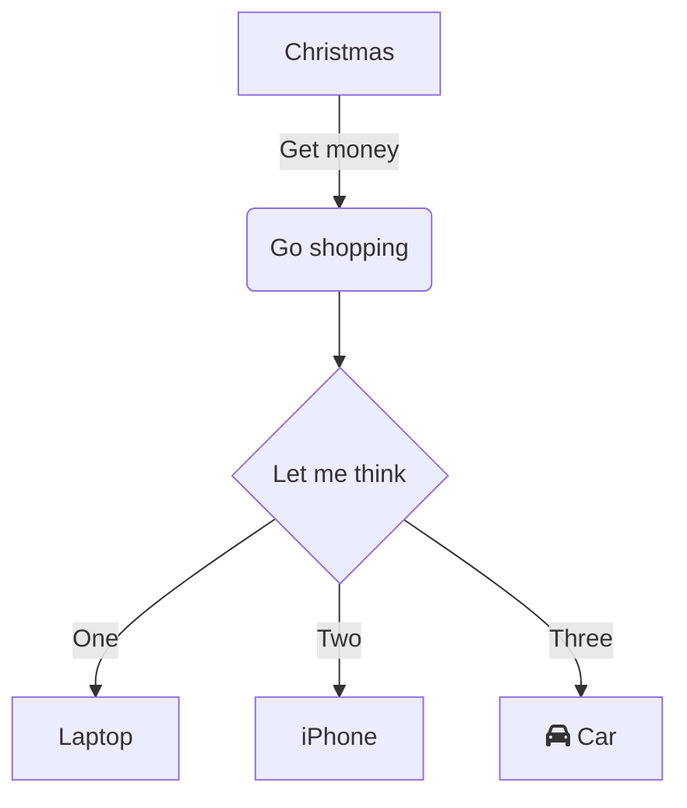

Date: 2023-11-03
Time: 22:57
Tags: #Obsidian 
Up: [[Obsidian]]

---
# Cose

# Titolo 1
## Titolo 2
### Titolo 3
#### Titolo 4
##### Titolo 5
###### Titolo 6

---

- oggetto1
	- oggetto 1.1

- [ ] task1
- [ ] task2

>Amore mio, non sei di nessun altro, ma di nessuna io
\- Tananai

>[!info]
>Here is a callout block
>It supports **Markdown**, [[Cose|link]]

> [!faq]- Are callouts foldable? 
> > Yes! In a foldable callout, the contents are hidden when the callout is collapsed.

> [!question] Can callouts be nested? 
> > [!todo] Yes!, they can.
> > > [!example] You can even use multiple layers of nesting.

```js
function fancyAlert(arg) {
  if(arg) {
    $.facebox({div:'#foo'})
  }
}
```

	Il testo che viene scritto dopo un tab viene formattato in questo modo # ciao

#tag
#important

| Header 1 | Header 2 | Header 3 |
| --------:|:--------:|:-------- |
|   cell 1 |  cell 2  | cell 3   |
|         |          |          |

(tilde alt+126)

|         Style          |       Syntax       |                Example                 |
|:----------------------:|:------------------:|:--------------------------------------:|
|          Bold          |   ** ** or __ __   |             **Bold text**              |
|         Italic         |      ** or __      |             *Italic text*              |
|     Strikethrough      |       ~~ ~~        |          ~~Striked out text~~          |
|       Highlight        |       == ==        |          ==Highlighted text==          |
| Bold and nested italic |   ** ** and _ _    | **Bold text and _nested italic_ text** |
|    Bold and italic     | *** *** or ___ ___ |       ***Bold and italic text***       |
|                        |                    |                                        |

Versione semplificata tabelle:

Header1|Header2
-|-
cell1|cell2


Latex:

$$\begin{vmatrix}a & b\\
c & d
\end{vmatrix}=ad-bc$$
Mermaid:


| Syntax   | Description                                                                                  |
| :--------: | :--------------------------------------------------------------------------------------------: |
| `[[ ]]`  | [Internal links](https://help.obsidian.md/Linking+notes+and+files/Internal+links)            |
| `![[ ]]` | [Embedding files](https://help.obsidian.md/Linking+notes+and+files/Embedding+files)          |
| `%%` | [Comments](https://help.obsidian.md/Editing+and+formatting/Basic+formatting+syntax#Comments) |
| `>[!note]` | [Callouts](https://help.obsidian.md/Editing+and+formatting/Callouts) |


Il testo racchiuso tra `backtick` (accenti gravi) viene formattato come codice.

[Pulsante](https://www.google.com/)

[[Prima riunione|Tesi Camilla, seconda riunione]] cosi creo un collegamento a un'altra nota
[[Prima riunione#Spiegazione1 (Concentrato su Alessandro)|Tesi Alessandro, prima riunione]] così creo un collegamento a un'altra nota e ad un titolo preciso della pagine


---
# References
