Created on date 2023-08-03 at 01:47
Status:
Tags: #mermaid

---
# Mermaid

## Flow Chart

Le possibili direzioni possono essere:
- TB - Top to bottom
- TD - Top-down/ same as top to bottom
- BT - Bottom to top
- RL - Right to left
- LR - Left to right

## Tutti i tipi di blocchi

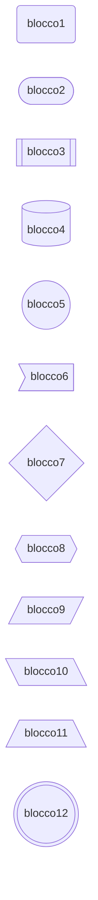

## Tipi di link

|      Length       |   1   |   2    |    3    |
|:-----------------:|:-----:|:------:|:-------:|
|      Normal       | `---` | `----` | `-----` |
| Normal with arrow | `-->` | `--->` | `---->` |
|       Thick       | `===` | `====` | `=====` |
| Thick with arrow  | `==>` | `===>` | `====>` |
|      Dotted       | `-.-` | `-..-` | `-...-` |
| Dotted with arrow | `-.->` | `-..->` | `-...->` |

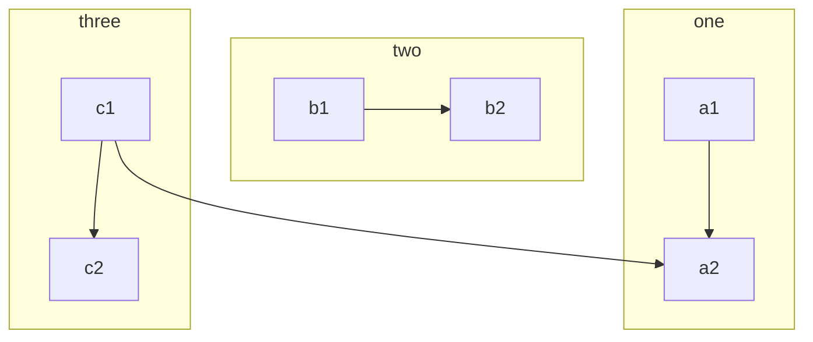

## Classi

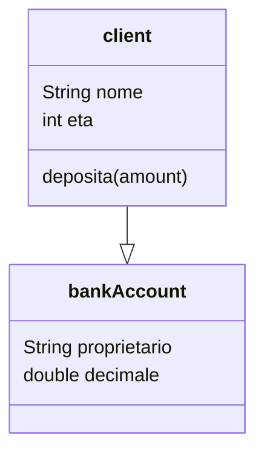

## Sequence Diagram

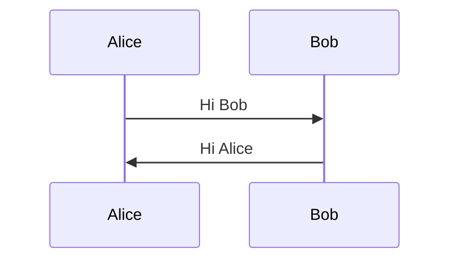

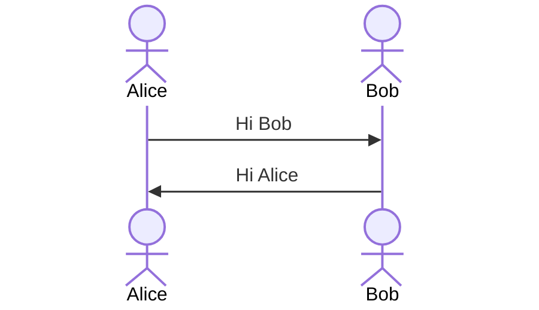

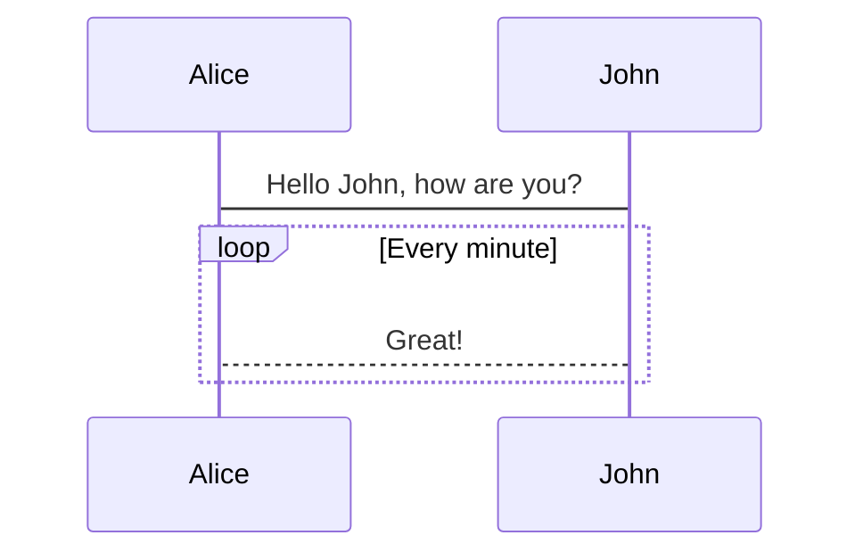

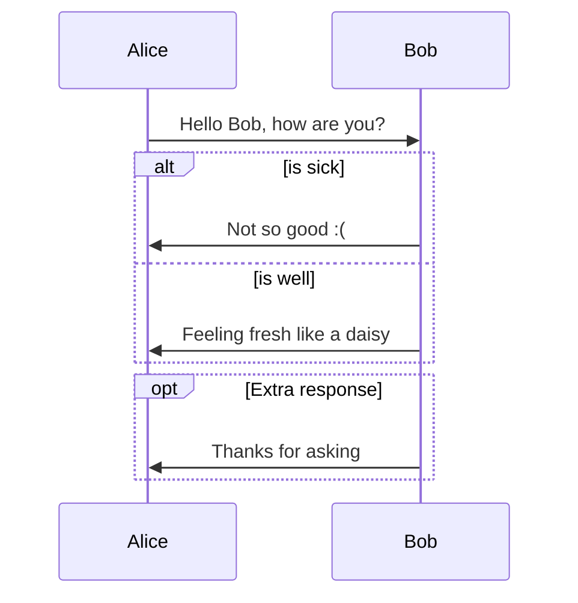

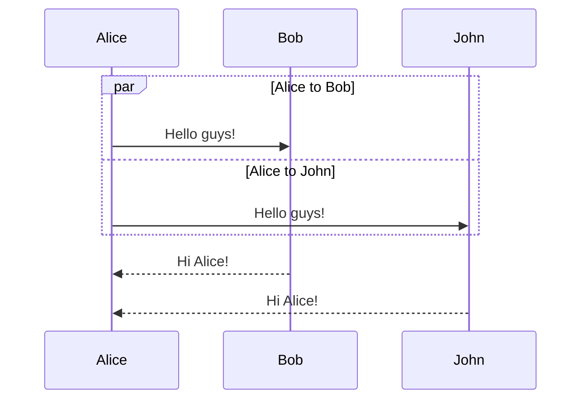

## State Diagram

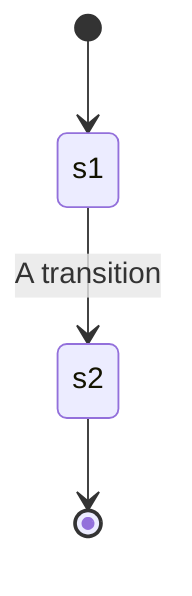

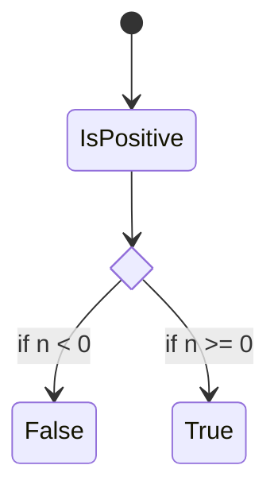

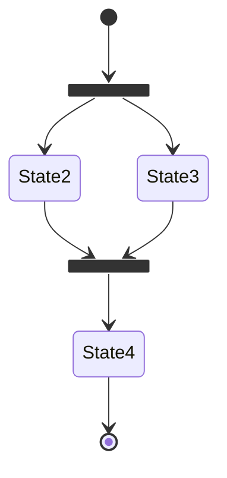

## Pie Chart

Drawing a pie chart is really simple in mermaid.

- Start with `pie` keyword to begin the diagram
    - `showData` to render the actual data values after the legend text. This is **_OPTIONAL_**
- Followed by `title` keyword and its value in string to give a title to the pie-chart. This is **_OPTIONAL_**
- Followed by dataSet. Pie slices will be ordered clockwise in the same order as the labels.
    - `label` for a section in the pie diagram within `" "` quotes.
    - Followed by `:` colon as separator
    - Followed by `positive numeric value` (supported up to two decimal places)

[pie] [showData] (OPTIONAL) [title] [titlevalue] (OPTIONAL) "[datakey1]" : [dataValue1] "[datakey2]" : [dataValue2] "[datakey3]" : [dataValue3] . .

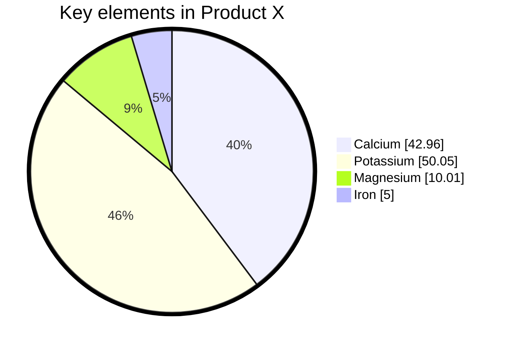

---
# References

[[Reference notes/Mermaid|Mermaid]]
